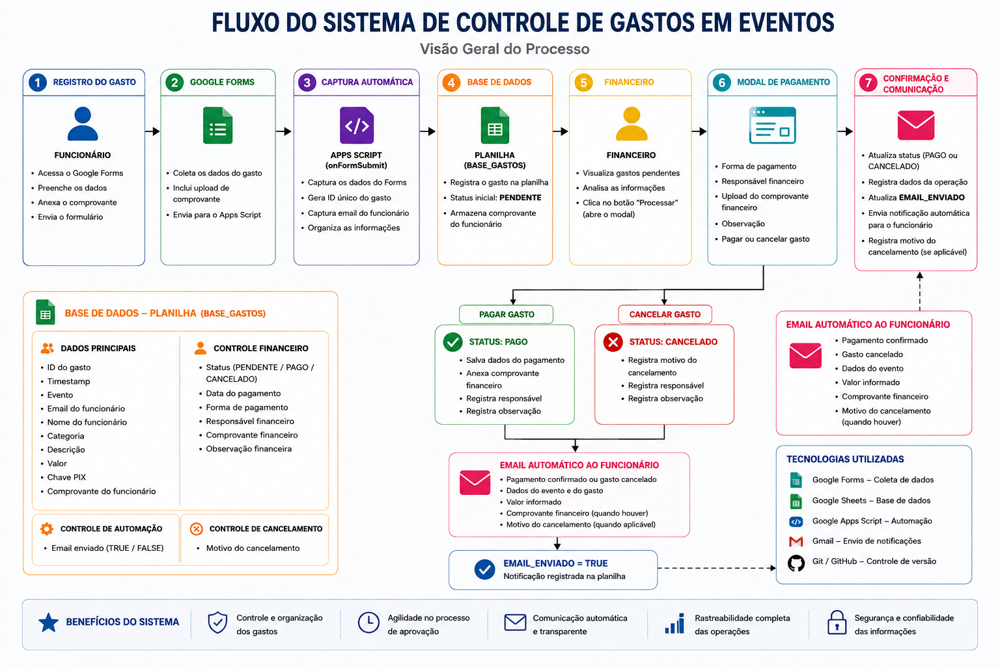

# Event-Expense-Manager-Novazul

Sistema de controle e automação de gastos em eventos corporativos, desenvolvido com Google Forms, Google Sheets e Google Apps Script.

## 🚀 Sobre o Projeto

Este projeto foi desenvolvido a partir de uma necessidade real observada dentro da Novazul.

Durante a rotina da empresa, o processo de solicitação e pagamento de gastos realizados por funcionários em eventos era feito de forma manual, envolvendo envio de comprovantes por mensagens, conferência de informações, cobranças recorrentes ao setor financeiro e pouca rastreabilidade sobre o status dos pagamentos.

A partir desse cenário, surgiu a ideia de criar uma solução simples, centralizada e automatizada para organizar todo o fluxo de registro, análise e pagamento dos gastos.

O projeto foi idealizado, estruturado e desenvolvido individualmente por Pedro Canuto, utilizando ferramentas do ecossistema Google para garantir baixo custo de implementação, facilidade de manutenção e rápida adoção pela equipe.

---

## 🎯 Objetivo

Automatizar o processo de controle de gastos em eventos corporativos, proporcionando:

* Organização das solicitações
* Centralização das informações
* Rastreabilidade dos pagamentos
* Comunicação automática com os funcionários
* Redução de atividades manuais do setor financeiro

---

## 🧠 Funcionalidades

### Registro de Gastos

* Solicitação de gastos via Google Forms
* Upload de comprovantes pelo funcionário
* Captura automática das respostas

### Automação

* Geração automática de ID único para cada gasto
* Registro automático na base de dados
* Atualização automática da área financeira

### Processamento Financeiro

* Visualização dos gastos pendentes
* Modal para processamento financeiro
* Registro da forma de pagamento
* Registro do responsável financeiro
* Upload do comprovante financeiro
* Inclusão de observações

### Cancelamento de Gastos

* Cancelamento diretamente pelo financeiro
* Registro do motivo do cancelamento
* Atualização automática do status

### Comunicação Automática

* Envio de e-mail quando o gasto é pago
* Envio de e-mail quando o gasto é cancelado
* Controle de notificação enviada (TRUE/FALSE)

---

## 🔄 Fluxo do Sistema



---

## 🏗 Arquitetura

### Google Forms

Responsável pela coleta das solicitações de gastos realizadas pelos funcionários.

### Google Apps Script

Responsável por toda a lógica de negócio, automações e integração entre os serviços.

### Google Sheets

Utilizado como base de dados do sistema.

### Gmail

Responsável pelo envio automático das notificações aos funcionários.

### Google Drive

Armazenamento dos comprovantes financeiros.

---

## 🛠 Tecnologias Utilizadas

* Google Apps Script
* Google Forms
* Google Sheets
* Gmail
* Google Drive
* Git
* GitHub

---

## 📁 Estrutura do Projeto

```text
docs/
├── docsflow.png

src/
├── config.gs
├── formHandler.gs
├── financeiro.gs
├── emailService.gs
├── utils.gs
├── main.gs

ui/
├── modalPagamento.html
```

---

## 📌 Principais Regras de Negócio

* Todo gasto inicia com status PENDENTE
* Cada gasto possui um ID único
* Apenas gastos pendentes podem ser processados
* Todo pagamento exige comprovante financeiro
* Todo cancelamento exige motivo registrado
* O sistema envia notificações automáticas ao funcionário
* O envio da notificação é registrado na base de dados

---

## 📈 Resultados Esperados

* Redução do trabalho manual do setor financeiro
* Maior controle sobre pagamentos
* Melhor comunicação entre funcionários e financeiro
* Histórico centralizado das operações
* Maior transparência e rastreabilidade do processo

---

## 👨‍💻 Autor

Pedro Canuto

Projeto desenvolvido como iniciativa de melhoria de processo interno e automação operacional para a Novazul.
